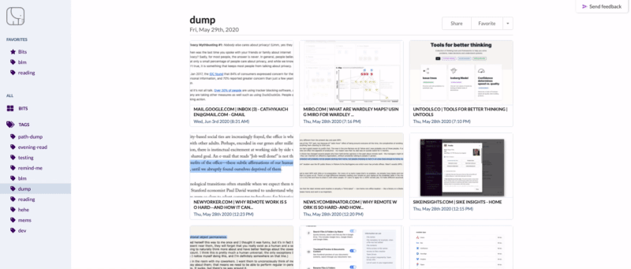

# simple-screenshot-feedback

[Full demo](https://cathykc.github.io/simple-screenshot-feedback/)

A simple plug and play feedback component for your website. Enable users to take screenshots of specific parts of your application and send feedback to a slack channel.



## Documentation
### Installation
```
yarn install simple-screenshot-feedback
```
or
```
npm install --save simple-screenshot-feedback
```

### Usage
```
import Feedback from "simple-screenshot-feedback"

export default function SomePage() {
  return (
    <>
      ...
      <Feedback slackToken={...} slackChannel={...} handleSubmitError={...} />
    </>
  )
}
```

#### Getting your Slack token
1. Log in to your Slack workspace at [api.slack.com/apps](https://api.slack.com/apps)
2. Click **Create New App**
3. Navigate to the **OAuth & Permissions** page by clicking on the left menu
4. Scroll down to **Bot Token Scopes** and add at minimum:
   - `chat:write` - allows the bot to write in private channels it is added to
   - `chat:write.public` - allows the bot to write in public channels
5. Go back to the top of the page and click **Install App to Workplace**, click **Allow**
6. You'll then be returned to the **OAuth & Permissions** page where you'll now see a **Bot User OAuth Access Token**

This is the token that you need to pass in to this component (`slackToken`) to start sending feedback to Slack.


#### Choosing a Slack channel
With the permissions you gave your new Slack app in **Getting your Slack token** you can now send feedback to any public channel by passing the channel name (e.g. `#feedback`) into the component (`slackChannel`).

If you want to post to a **private** channel you first need to invite the new Slack app to it by typing `/invite @[APP NAME]`.


### Options

| Prop                | optional  | default         | type                                                                                              |
|:--------|:-------:|:-------:|--------:|
| slackToken          | false     |                 | string                                                                                            |
| slackChannel        | false     |                 | string                                                                                            |
| handleSubmitError   | false     |                 | (err: Error) => void                                                                              |
| location            | true      | "bottom-right"  | "top-left" \| "top-middle" \| "top-right" \|  <br>"bottom-left" \| "bottom-middle" \| "bottom-right"  


### SSR
This component uses the `html2canvas` library which depends on the `window` object being available. If you're using server-side rendering you'll want to make sure this component is only imported on client render using dynamic imports. 

Here's an example with `next/dynamic`:
```
import dynamic from "next/dynamic";
import React from "react";

const FeedbackImport = dynamic(() => import("simple-screenshot-feedback"), { ssr: false });

export default function Feedback({ slackToken, slackChannel, handleSubmitError }) {
  return (
    <FeedbackImport
      slackToken={slackToken}
      slackChannel={slackChannel}
      handleSubmitError={handleSubmitError}
    />
  );
}
```
